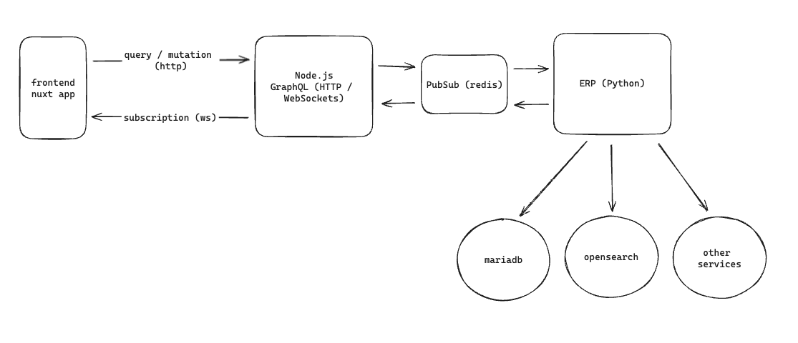

# GraphQL Subscriptions / Redis Example

Demo showing GraphQL subscriptions with Apollo Server linking up to another service (in this case, python) via redis.

# Architecture

The design is based off the information found in the [Apollo Docs](https://www.apollographql.com/docs/apollo-server/data/subscriptions/).

Here's the overview:



Subscriptions in GraphQL are implemented via an AsyncIterator. A trivial example:

```ts
const resolvers = {
  Subscription: {
    hello: {
      // Example using an async generator
      subscribe: async function*() {
        for await (const word of ["Hello", "Bonjour", "Ciao"]) {
          console.log("yield => ", word);

          // delay for demo

          await new Promise((res) => setTimeout(res, 1000));
          yield { hello: word };
        }
      },
    },
  },
};
```

In the actual demo, this is supplied via the [`graphql-redis-subscriptions`](https://github.com/davidyaha/graphql-redis-subscriptions) library, which uses redis.

# Setup

## Redis

Install and start redis. Assuming default port 6379.

## Node.js

```sh
# install
npm install

# compile and start
npm run start
```

## Python

```sh
# virtual env
python -m venv venv
source venv/bin/activate

# run
python server.py
```

# Demo

Visit `http://localhost:4000/graphql` and run a subscription:

```gql
subscription {
    hello
  }
}
```

You should see a count incrementing every second:


## Frontend Integration

There is a Vue / Urql example. Ensure everything is running and: 

```sh
cd frontend
npm install
npm run dev
```

http://localhost:5173 has a Vue app with a query and subscription running.
